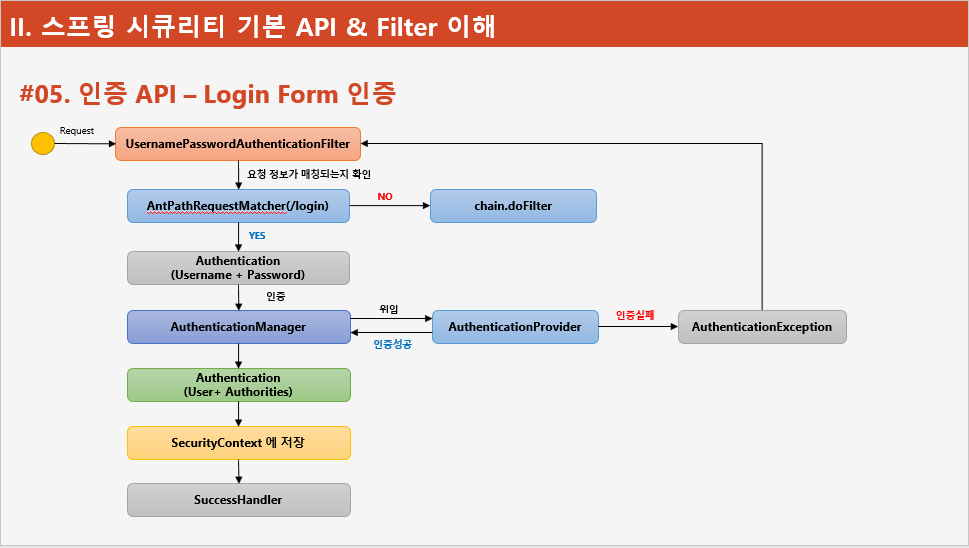
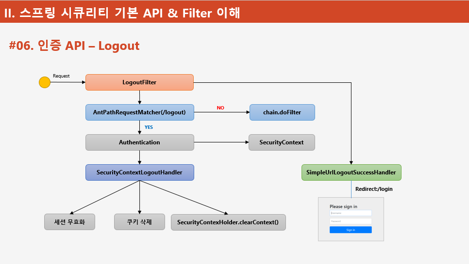
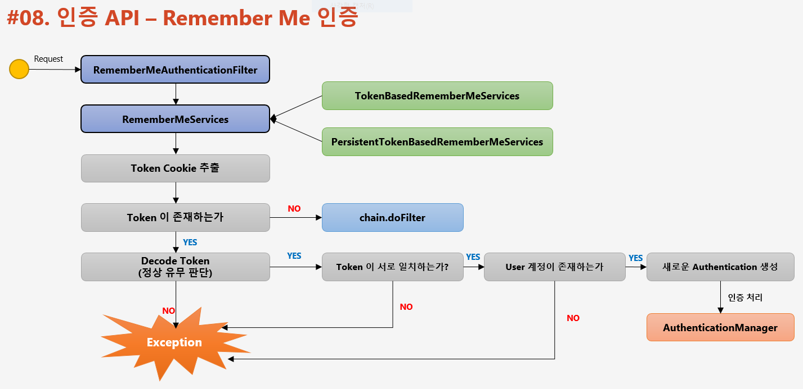
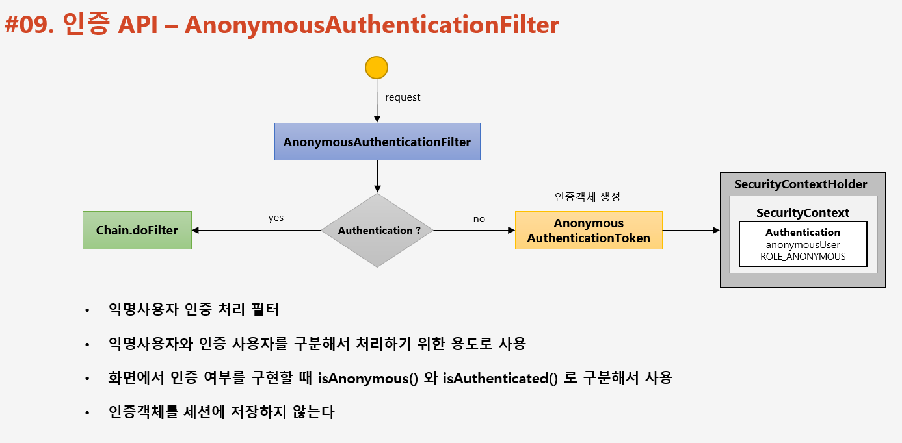
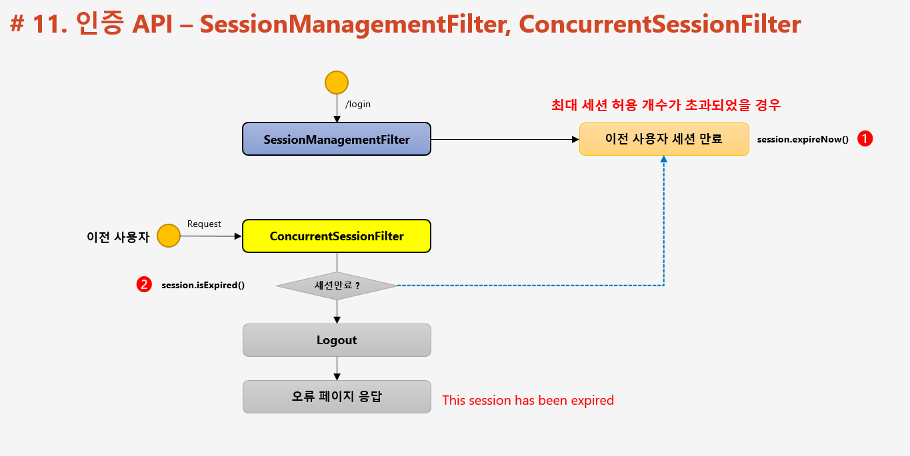

# Spring Security
- - -

## 프로젝트 구성 및 의존성 추가
~~~
<dependency>
    <groupId>org.springframework.boot</groupId>
    <artifactId>spring-boot-starter-security</artifactId>
</dependency>
~~~
**스프링 시큐리티의 의존성 추가 시**
1. 서버가 기동되면 스프링 시큐리티의 초기화 작업 및 보안 설정이 이루어진다.
2. 별도의 설정이나 구현을 하지 않아도 기본적인 웹 보안 기능이 현재 시스템에 연동되어 작동한다.
	- 모든 요청은 인증이 되어야하 자원에 접근이 가능
	- 인증 방식
		- 폼 로그인
		- httpBasic 로그인
	- 기본 로그인 페이지 제공
	- 기본 계정 한 개 제공
		- ID    : user
		- PWD : 랜덤 문자열

**문제점**
1. 계정 추가 권한 추가, DB 연동 등
2. 기본적인 보안 기능 외에 시스템에서 필요로 하는 더 세부적이고 추가적인 보안기능이 필요

## 사용자 정의 보안 기능 구현
- security 의존성 추가했을경우 보안설정을 할 수 있는 클래스로 해당 클래스를 상속을 받아 사용할 경우 HttpSecurity 클래스의 인증 API, 인가 API를 자유롭게 정의할 수 있다.    
- 다른요청들은 인증을 하지 않을경우 기본 폼로그인으로 이동된다.
~~~
@Configuration
@EnableWebSecurity
public class SecurityConfig extends WebSecurityConfigurerAdapter {

    @Override
    protected void configure(HttpSecurity http) throws Exception {
        http
                .authorizeRequests()
                .anyRequest().authenticated();
        http
                .formLogin();
    }
}
~~~

- 매번 랜덤 문자열로 로그인 해야하는 비밀번호의 경우 application.properties 에 등록해서 간편하게 사용할 수 있다.

~~~
spring.security.user.name=user
spring.security.user.password=1111
~~~

## Form Login 인증

### configure() 메소드 설정
~~~
http.formLogin()                              // Form 로그인 인증 기능이 작동함
    .loginPage("loginPage")                  // 사용자 정의 로그인 페이지
    .defaultSuccessUrl("errorPage")          // 로그인 실패 후 이동 페이지
    .usernameParameter("username")          // 아이디 파라미터명 설정
    .passwordParameter("password")          // 패스워드 파라미터명 설정
    .loginProcessingUrl("/login")           // 로그인 form action url
    .successHandler(loginSuccessHandler())  // 로그인 성공 후 핸들러
    .failureHandler(loginFailurHandler())   // 로그인 실패 후 핸들러
~~~
### 로그인 처리
1. 사용자 인증 시도 시 UsernamePasswordauthenticationFilter 에서 사용자 정보를 확인한다
2. AntPathRequestMatcher 에서 로그인 정보를 확인한다.
    - 정보가 미 일치 시 다른 필터로 이동
3. 정보가 일치 시 Authentication 에서 사용자가 입력한 로그인 값을 저장하여 인증 객체를 생성한다.
4. AuthenticationManager 에서 인증 처리를 하는데 AuthenticationProvider 에게 인증처리를 위임한다.
    - 인증 실패 시 AuthenticationException 발생
    - 인증 성공 시 권한 정보 및 인증 객체를 저장하여 AhthenticationManager 에게 전송한다.
5. AuthenticationManager 는 인증 객체를 Authentication 에게 반환한다.
6. Authentication 에서 인증 결과인 인증 객체를 Securitycontext 에 전송한다.
7. SecurityContext 에서 인증 객체를 저장한다
8. SuccessHandler 처리

## Logout 처리, LogoutFilter

로그아웃이 일어날 경우 세션, 인증토큰, 쿠키정보를 삭제하며 로그인 페이지로 이동한다.

~~~
http.logout()                                           // 로그아웃 처리
    .logoutUrl("/logout")                               // 로그아웃 처리 URL
    .logoutSuccessUrl("/login")                         // 로그아웃 성공 후 이동 페이지
    .deleteCookies("JSESSIONIN", "remember-me")         // 로그아웃 후 쿠키 삭제
    .addLogouthandler(logouthandler())                  // 로그아웃 핸들러
    .logoutSuccessHandler(logoutSuccessHandler())       // 로그아웃 성공 후 핸들러
~~~
deleteCookies로 특정 쿠키를 삭제할 수 있으며, 만약 추가 작업이 필요하다면 로그아웃 핸들러를 이용하여 작업을 추가할 수 있다.

### 로그아웃 처리
1. LogoutFiter가 POST방식의 로그아웃을 받는다.
2. AntPathRequestMatcher에서 로그아웃을 요청하는건지 검사를 한다.
    - 미 일치시 chain.doFiter 그다음 필터로 보낸다
3. 일치 시 Authentication 에서 securityContext 에서 인증 객체를 꺼내온다.
4. SecurityContextLogoutHandler 에서 세션 무효화, 쿠키 삭제, securityContext.clearContext() 컨텍스트에서 정보를 삭제한다.
5. 로그아웃이 성공적 으로 끝날 경우 SimpleUrlLogoutSuccessHandler 에서 다시 login 페이지로 이동시킨다.

## Remember Me 인증
- 세션이 만료되고 웹 브라우저가 종료된 이후에도 애플리케이션이 사용자를 기억하는 기능
- RememberMe 쿠기에 대한 Http 요청을 확인 후 토큰 기반 인증을 사용해 유효성을 검사하고 토근이 검증되면 로그인이 된다.
- 사용자 라이프 사이클
    1. 인증 성공 (Rembmer-Me 쿠키 설정)
    2. 인증 실패(쿠키가 존재하면 쿠키 무효화)
    3. 로그아웃(쿠키가 존재하면 쿠키 무효화)

~~~
htpp.rememberMe()
    .rememberMeParameter("remember")        // 기본 파라미터명은 remember-me
    .tokenValiditySeconds(3600)             // 만료시간 default 는 14일
    .alwaysRemember(true)                   // 리멤버 기능이 활성화 되지 않아도 항상 실행 default 는 false
    .userDetailsService(userDetailsService) // remember-me 인증 후 처리할 서비스
~~~
**JSESSION을 삭제하더라도 Security에서 쿠키가 있는지 확인 후 있을경우 user객체를 얻어 그 객체로 로그인을 시도한다.** 

## RememberMeAuthenticationFilter

### Remember Me 인증 절차
1. 사용자의 세션이 있는지 필터를 통하여 검증
	세션이 없을 시 RememberMeAuthenticationFilter 가 사용자의 인증을 다시 받도록 시도한다.
2. 사용자의 재 인증 과정은 PersistentTokenBasedRememberMeService 가 사용자 토큰과 DB에 저장된 토큰이 일치한지 확인을 한다.
3. 토큰이 일치할 경우 토큰에서 쿠키를 추출한다.
4. 추출한 토큰이 rememberBe 인지 확인한다.
	미 일치 시 다른 필터로 이동
5. 토큰의 형식이 일치한지 확인한다.
	미 정상 시 예외를 발생시킨다.
6. 사용자의 토큰과 서버에 저장된 토큰이 일치한지 확인한다.
	미 일치 시 예외를 발생시킨다.
7. 토큰의 User 계정이랑 DB 에 저장된 User 계정이랑 동일한지 확인한다.
	미 일치 시 예외를 발생시킨다.
8. 전부 검증이 끝날경우 새로운 Authentication 객체를 만들어 AuthenticationManager 에게 전달한다.
9. 이후 JSESSION 을 재발급하며 사용자 정보를 담는다.

   
## AnonymousAuthenticationFilter
사용자의 인증 과정이 다른 필터랑 거의 동일하게 처리가 이루어 지지만 인증을 받지 않은 사용자일 경우 익명 객체를 만들어 SecurityContext 에 해당 객체를 저장하는 점이 다르다.

1. 사용자의 요청을 받을 경우 해당 사용자의 인증객체가 SecurityContext 에 존재하는지 확인한다.
2. 해당 객체가 존재하지 않을 경우 새로운 익명사용자 객체인 AnonymousAuthenticationToken 을 생성하여 SecurityContext 에 저장한다.
	- 실제로 인증을 받은 사용자가 아니라면 세션에 인증객체를 저장하지 않는다. 
3. 해당 사용자가 다른 요청을 할 경우 Security 는 SecurityContext 에 저장된 객체를 확인하여 익명 사용자인지 인증 받은 사용자인지 확인한다.
	- 또한 화면에서 인증 여부를 통하여 익명사용자와 인증 받은 사용자를 구분할 수 있다.

최초에 요청하는 사용자가 인증객체가 존재하는지 확인한다. securityContext 에 객체 존재하는지 확인
1. 존재 시 다음 필터로 이동
2. 미 존재 시 익명사용자용 인증객체인 AnonymousAuthenticationToken 을 생성 후 SC 에 저장한다.
3. 추 후 SC 에서 객체가 존재하는지 확인할 때 해당 사용자가 익명사용자인지 인증 사용자인지 확인한다.
4. 또한 화면에서 인증 여부 구현 시 익명사용자인지, 로그인한 사용자인지 구분가능할 수 있다.
5. 실제로 인증을 받은 사용자가 아니기에 세션에 인증객체를 저장하지 않는다.

## 동시 세션 제어

현재 동일한 계정으로 인증을 받을때 세션의 허용 갯수 초과 시 어떻게 유지하는지 제어를 의미한다.

2가지 전략으로 세션 제어를 지원

1. 이전 세션을 만료시킴
    - 이전 세션 만료 설정
2. 지금 세션 인증 실패
    - 2 번째 사용자 세션 차단
    
~~~
http.sessionManagement()
    .maximumSessions(1)             // 세션 최대 수
    .maxSessionsPreventsLogin(true) // 동시 로그인 차단 (지금 세션 차단) false 설정 시 이전 세션 만료 설정
    .invalidSessionUrl("/invalid")  // 세션이 유효하지 않을 경우 이동할 페이지
    .expiredUrl("/expired")         // 세션이 만료된 경우 이동 할 페이지
invalidSessionUrl() 과 expiredUrl() 을 같이 설정할 경우 invalidSessionUrl() 이 실행된다.
~~~

### 세션 고정 보호
세션 고정 공격으로 부터 스프링은 매번 새로운 세션을 만드는 세션 고정 보호를 제공한다.

### 세션 고정 공격
세션 고정 공격은 공격자가 서버에 접속하여 세션의 아이디를 얻은 후 이를 사용자에게 주어 사용자가 공격자의 세션 쿠키를 이용해 로그인하는 경우 이루어 진다. 이경우 사용자가 보고있는 정보를 공격자가 같이 확인할 수 있다.

~~~
http.sessionManagement()
    .sessionFixation().changeSessionId()    // 기본 값
                                            // none, migrateSession, new Session
~~~

### 세션 정책

~~~
http.sessionManagement()
    .sessionCreationPolicy(SessionCreationPolicy.If_Required)

SessioncreationPolicy.Always        // 스프링 시큐리티가 항상 세션 생성
SessioncreationPolicy.If_Required   // 스프링 시큐리티가 필요 시 생성    기본 시 이 속성 사용
SessioncreationPolicy.Never         // 생성하지 않지만 이미 존재하면 사용
SessioncreationPolicy.Stateless     // 생성하지도 않으며 존재하지도 않음   JWT 처럼 토큰에 저장하고 인증 시 이 속성 사용
~~~

## SessionManagementFilter & ConcurrentSessionFilter

### SessionManagementFilter
1. 세션 관리
    - 인증 시 사용자의 세션정보를 등록, 조회, 삭제 등의 세션 이력을 관리
2. 동시적 세션 제어
    - 동일 계정으로 접속이 허용되는 최대 세션 수를 제한
3. 세션 고정 보호
    - 인증 할 때마다 세션 쿠키를 새로 재발급 받아 공격자의 쿠키 조작을 방지
4. 세션 생성 정책
    - Always, If_Required, Never, Stateless
    
### ConcurrentSessionFilter    
- 매 요청마다 현재 사용자의 세션 만료 여부 체크
- 세션이 만료되었을 경우 즉시 만료 처리
- Session.isExpired() == true
    1. 로그아웃 처리
    2. 즉시 오류 페이지 응답 (This Session has been expired)

### SessionManagementFilter & ConcurrentSessionFilter 연계

1. 새로운 사용자가 동일한 계정으로 로그인 시도 시 SessionManagementFilter 에서 최대 세션 허용 개수가 초과 한 경우 이전 사용자 세션을 만료 시킨다.
2. 이전 사용자의 경우 ConcurrentSessionFilter 에서 SessionManagementFilter 에게 세션의 만료 여부에 알아보며 만료 시 로그아웃 후 오류 페이지를 응답한다.
 

