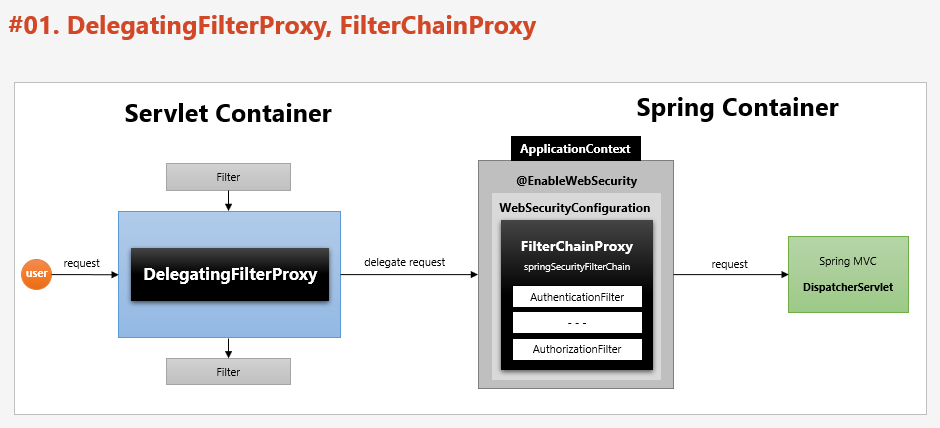

# 스프링 시큐리티 주요 아키텍처 이해
## DelegatingFilterProxy, FIlterChainProxy

### DelegatingFilterProxy

1. 서블릿 필터는 스프링에서 정의된 빈을 주입해서 사용할 수 없음
2. 특정한 이름을 가진 스프링 빈을 찾아 그 빈에게 요청을 위임
    - springSecurityFilterChain 이름으로 생성된 빈을 ApplicationContext 에서 찾아 요청을 위임함
    - 실제 보안처리를 하지 않음

### FilterChainProxy

1. springSecurityChain 의 이름으로 생성되는 필터 빈
2. DelegatingFIlterProxy 으로 부터 요청을 위임 받고 실제 보안을 처리
3. 스프링 시큐리티 초기화 시 생성되는 필터들을 관리하고 제어
    - 스프링 시큐리티가 기본적으로 생성하는 필터
    - 설정 클래스에서 API 추가 시 생성되는 필터
4. 사용자의 요청을 필터 순서대로 호출하여 전달
5. 사용자정의 필터를 생성해서 기존의 필터 전.후로 추가 가능
    - 필터의 순서를 잘 정의
6. 마지막 필터까지 인증 및 인가 예외가 발생하지 않으며 보안 통과

## 필터 초기화와 다중 보안 설정

- 설정클래스 별로 보안 기능이 각각 작동
- 설정 클래스 별로 RequestMatcher 설정
    - http.antMatcher("/admin/**)
- 설정클래스 별로 필터가 생성
- FilterChainProxy 가 각 필터를 가지고 있음

- 요청에 따라 RequestMatcher와 매핑되는 필터가 작동하도록 함
    - FilterChainProxy 객체가 각각 SecurityFilterChain 을 List 형태로 저장하고 있음
    - 사용자 요청에 맞는 필터를 선택해 인증/인가가 이루어 진다.
        - Config가 여러개면 @Order(n) 어노테이션을 이용해 어떤 Config를 우선적으로 필터를 확인할지 정할 수 있다. 
    