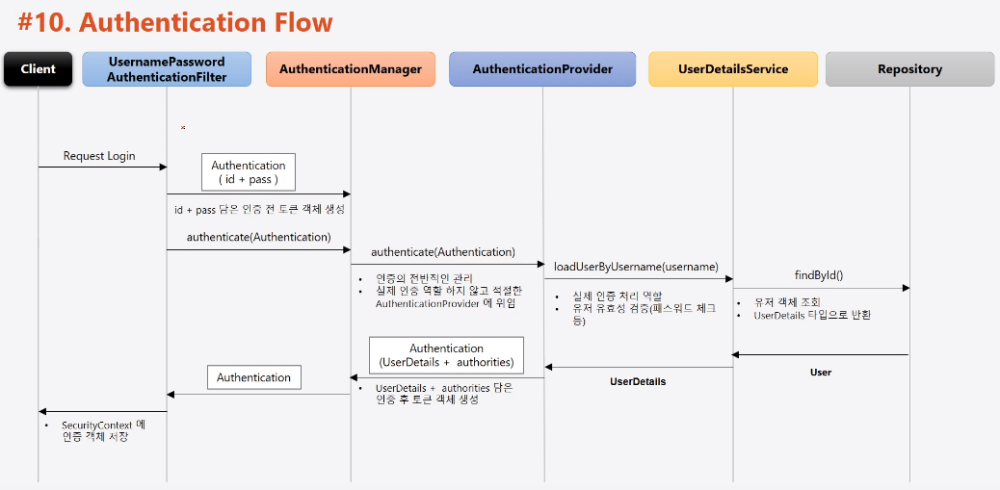

# 스프링 시큐리티 주요 아키텍처 이해
## DelegatingFilterProxy, FIlterChainProxy

### DelegatingFilterProxy

1. 서블릿 필터는 스프링에서 정의된 빈을 주입해서 사용할 수 없음
2. 특정한 이름을 가진 스프링 빈을 찾아 그 빈에게 요청을 위임
    - springSecurityFilterChain 이름으로 생성된 빈을 ApplicationContext 에서 찾아 요청을 위임함
    - 실제 보안처리를 하지 않음

### FilterChainProxy

1. springSecurityChain 의 이름으로 생성되는 필터 빈
2. DelegatingFIlterProxy 으로 부터 요청을 위임 받고 실제 보안을 처리
3. 스프링 시큐리티 초기화 시 생성되는 필터들을 관리하고 제어
    - 스프링 시큐리티가 기본적으로 생성하는 필터
    - 설정 클래스에서 API 추가 시 생성되는 필터
4. 사용자의 요청을 필터 순서대로 호출하여 전달
5. 사용자정의 필터를 생성해서 기존의 필터 전.후로 추가 가능
    - 필터의 순서를 잘 정의
6. 마지막 필터까지 인증 및 인가 예외가 발생하지 않으며 보안 통과

## 필터 초기화와 다중 보안 설정

- 설정클래스 별로 보안 기능이 각각 작동
- 설정 클래스 별로 RequestMatcher 설정
    - http.antMatcher("/admin/**)
- 설정클래스 별로 필터가 생성
- FilterChainProxy 가 각 필터를 가지고 있음

- 요청에 따라 RequestMatcher와 매핑되는 필터가 작동하도록 함
    - FilterChainProxy 객체가 각각 SecurityFilterChain 을 List 형태로 저장하고 있음
    - 사용자 요청에 맞는 필터를 선택해 인증/인가가 이루어 진다.
        - Config가 여러개면 @Order(n) 어노테이션을 이용해 어떤 Config를 우선적으로 필터를 확인할지 정할 수 있다. 
    
## Authentication

당신이 누구인지 증명하는 것
    - 사용자의 인증 정보를 저장하는 토큰 개념
    - 인증 시 id 와 password 를 담고 인증 검증을 위해 전달되어 사용된다.
    - 인증 후 최종 인증 결과 (user 객체, 권한정보) 를 담고 SecurityContext 에 저장되어 전역적으로 참조가 가능하다.
        - Authentication authentication = SecurityContextHolder.getContext().getAuthentication()
    - 구조
        1. principal : 사용자 아이디 혹은 User 객체를 저장
        2. credentials : 사용자 비밀번호
        3. authorities : 인증된 사용자의 권한 목록
        4. details : 인증 부가 정보
        5. Authenticated : 인증 여부ㅁ

### Authentication 인증 구조

1. username + password 를 UsernamePasswordAuthenticationFilter 에게 전달
2. Authentication 인증객체를 생성 후 AuthenticationManager 에게 전달
3. 인증에 성공 시 Authentication 최종 인증객체를 생성 후 SecurityContext 에 저장
    - 실패 시 예외 발생 후 chainFilter...
4. 최종 작업 이후 인증 객체를 전역적으로 사용이 가능해짐

## SecurityContextHolder, SecurityContext

1. SecurityContext
    - **Authentication 객체가 저장되는 보관소**로 필요 시 언제든지 Authentication 객체를 꺼내어 쓸 수 있도록 제공되는 클래스
        - Authentication 은 User 객체가 저장됨
            - User 객체는 인증 성공 시 만들어짐
    - ThreadLocal 에 저장되어 아무 곳에서나 참조가 가능하도록 설계함
        - Thread 마다 고유하게 할당된 로컬이 ThreadLocal 이며, 다른 Thread 가 접근할 수 없다.
    - 사용자의 인증이 완료되면 HttpSession 에 저장되어 애플리케이션 전반에 걸쳐 전역적인 참조가 가능하다.
2. SecurityContextHolder
    - SecurityContext 를 감싸고 있으며, SecurityContext 객체 저장 방식
        - MODE_THREADLOCAL : 스레드당 SecurityContext 객체를 할당 (default)
        - MODE_INHERITABLETHREADLOCAL : 메인 스레드와 자식 스레드에 관하여 동일한 SecurityContext 를 유지
        - MODE_GLOBAL : 응용 프로그램에서 단 하나의 SecurityContext 를 저장한다.
    - SecurityContextHolder.clearContext() : SecurityContext 기존 정보 초기화
3. Authentication authentication = SecurityContextHolder.getContext().getAuthentication()
        
### SecurityContextHolder, SecurityContext

1. 로그인 시 Authentication 객체를 만들고 인증여부를 판단한다.
    - 실패 시 clearContext()
    - 성공 시 SecurityContext 안에 있는 SecurityContext 에 Authentication 에 객체 정보를 변경하여 저장하며, 최종적으로 HttpSession 에 저장한다.
    
## SpringSecurityContextPersistentFilter
    
SecurityContext 객체의 생성, 조회, 저장 하는 필터이다.

1. 익명 사용자
    - 새로운 SecurityContext 객체를 생성하여 SecurityContextHolder 에 저장
    - AnonymousAuthenticationFilter 에서 AnonymousAutenticationToken 객체를 SecurityContext 에 저장

2. 인증 시
    - 새로운 SecurityContext 객체를 생성하여 SecurityContextHolder 에 저장
    - UsernamePasswordAuthenticationFilter 에서 인증 성공 후 SecurityContext 에 UsernamePasswordAuthenticationToken 객체를 SecurityContext 에 저장
    - 인증이 최종 완료되면 Session 에 SecurityContext 를 저장

3. 인증 후
    - Session 에서 SecurityContext 꺼내어 SecurityContextHolder 에서 저장
    - SecurityContext 안에 Authentication 객체가 존재하면 계속 인증을 유지한다.

4. 최종 응답 시 공통
    - SecurityContextHolder.clearContext() 메소드를 실행하여 Context 를 삭제한다.

### SecurityContextPersistenceFilter

1. 사용자 요청 시 사용자 요청 인증여부를 확인한다.
2. 인증 전 일 경우 새로운 SecurityContext 를 Holder 에서 생성한다
3. 인증 필터가 인증을 처리하며 SecurityContextHolder 안에서 Authentication 객체를 생성해 context 에 저장한다.
4. doFilter 이후 Session 에 Context 를 저장한다.
5. 앞으로 인증은 Session 을 통해 SecurityContext 가 있는지 확인 후 Session 에서 꺼내 사용한다.

## Authentication Flow

1. form 인증 로그인 요청 시
2. UsernamePasswordAuthenticationFilter 에서 요청을 받고 Authentication 객체를 생성해 요청에 들어온 id, password 를 담고 AuthenticationManager 에게 보낸다
3. AuthenticationManager 는 인증을 처리할 authenticationProvider 에게 인증을 위임한다.
4. AuthenticationProvider 는 인증 객체를 검증하면서 UserDetailsService 에게 id 를 전달하며 user 객체를 요청한다
5. UserDetailService 는 Repository 에서 유저 객체를 조회 하여 UserDetail 타입으로 반환하거나 예외를 발생시키며 인증을 종료한다.
6. AuthenticationProvider 는 반환받은 객체와 사용자 입력 패스워드가 일치한지 확인 후 Authentication(UserDetails + authorities) 토큰 객체를 AuthenticationManager 에게 전달한다.
7. AuthenticationManager 는 다시 filter 에게 인증객체를 다시 전달한다.
8. filter 는 인증객체를 다시 SecurityContext 에 저장한다.
